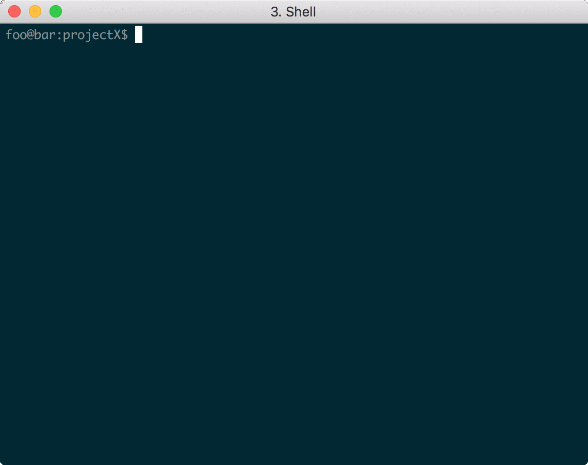

# backupSession 

  <!-- badges: start -->
[](https://github.com/makeyourownmaker/backupSession/actions)
[](https://codecov.io/github/makeyourownmaker/backupSession)


  <!-- badges: end -->

backupSession is an R package for saving and loading consistently named and versioned R session images, history, metadata and sessionInfo().

If you like backupSession, give it a star, or fork it and contribute!


## Usage 



Avoid one by one saving inconsistently named and/or versioned session images, history files etc :-)

```r
# Start new R session
library(backupSession)
# Work, work, work ...
save.session(basename='projectX', version='01.03.18.11.43', path='./backups')
q('no')

# Restart R session
library(backupSession)
load.session(basename='projectX', version='01.03.18.11.43', path='./backups')
# Data, command history etc loaded
```


## Installation

Requires R version 3.2.0 and higher.

```r
install.packages("devtools") # Install devtools package if necessary
library(devtools)
devtools::install_github("makeyourownmaker/backupSession")
```


## Details

The save.session function saves four files:
1) R session image in path/basename.version.RData
2) R history in path/basename.version.RHistory
3) R metadata in path/basename.version.MData
4) R sessionInfo() in path/basename.version.SInfo

The load.session function loads session images and if available session history files into the current R session.  It will overwrite existing data.

The load.mdata function loads the saved metadata (output of the ls.str() command) into the current R session.

The load.sinfo function loads the saved output of the sessionInfo() command into the current R session.

The path parameter defaults to the current working directory.  The save.session function will create directories specified
using the path parameter unless they exist.

The version parameter in the save.session function defaults to a timestamp ("%y.%m%.%d.%H.%M" eg. 2018.12.30.09:40) unless an alternative is specified.

The save.session, load.session, load.mdata and load.sinfo functions have verbose options which print session saving and loading progress messages.

The force option in the save.session function will overwrite existing files.

History files are not saved during __non-interactive__ R sessions.  So may not always be available for loading.

The [testthat](http://testthat.r-lib.org/) package is required to run the tests but is not required for normal installations.

Further info:
```r
?save.session
?load.session
?load.mdata
?load.sinfo
```


## Roadmap

* Enhance meta data file support
  * Check if loading a backup will overwrite existing data in current R session
  * Summarise changes between backups
  * Remove redundant and/or excess backup files
* Make CRAN release


## Contributing
Pull requests are welcome.  For major changes, please open an issue first to discuss what you would like to change.


## Alternatives

* [logR: Flexible logging of R console sessions](https://github.com/jdthorpe/logR)
* [track: Store Objects on Disk Automatically](https://cran.r-project.org/web/packages/track/index.html)


## License
[GPL-2](https://www.gnu.org/licenses/old-licenses/gpl-2.0.en.html)
